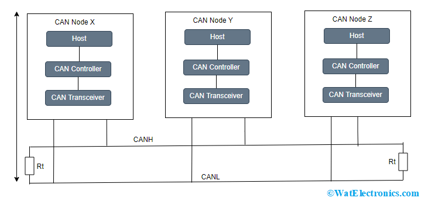
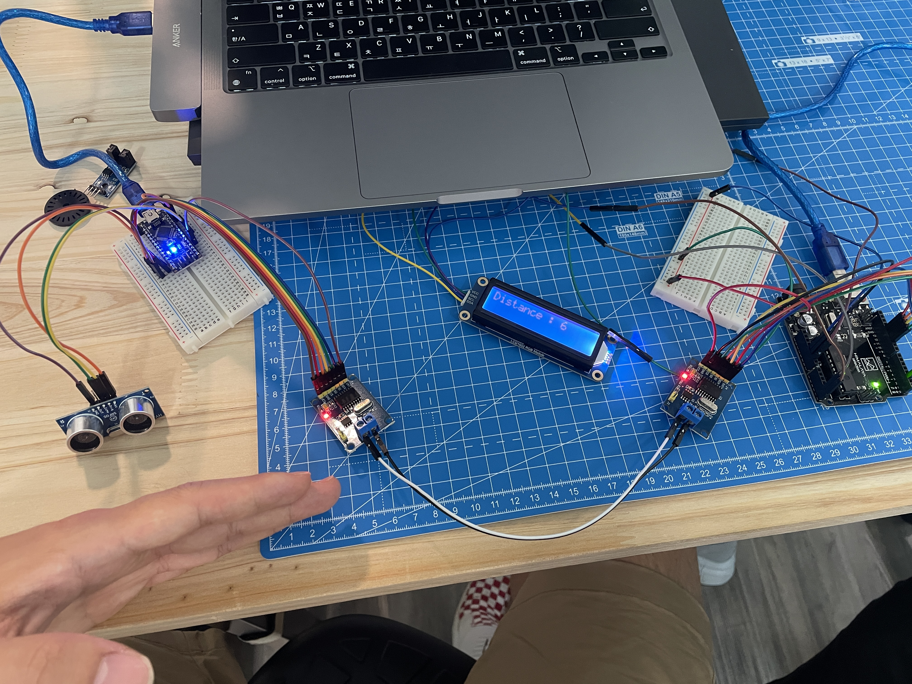
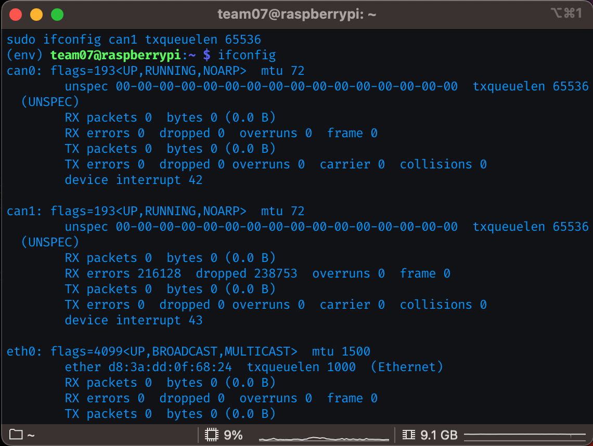
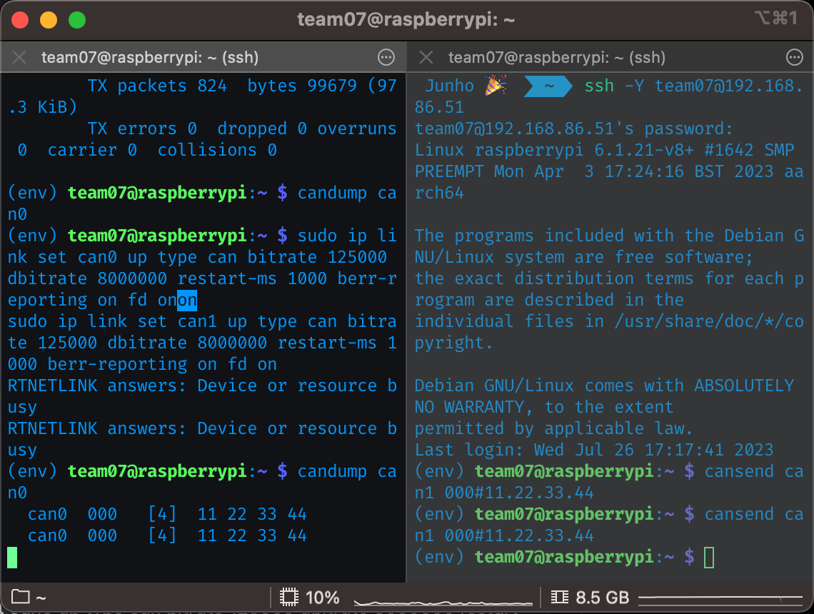

# CAN (Controller Area Network) Communication Protocol
-----------------------------------------------------------

## Table of Contents
1. [Introduction](#introduction)
2. [CAN High and CAN Low](#can-high-and-can-low)
3. [Termination Resistance](#termination-resistance)
4. [Additional Details](#additional-details)

----------------------------------------

## Introduction
CAN (Controller Area Network) is a widely used communication protocol in the automotive and industrial sectors for reliable and efficient data exchange between electronic control units (ECUs). It was initially developed by Bosch in the 1980s to address the increasing complexity of electrical systems in vehicles and has since become an industry standard. The CAN protocol allows multiple ECUs to communicate with each other over a shared bus, enabling real-time data transmission.



## CAN High and CAN Low
CAN communication uses a differential pair of wires for transmission: CAN High (CAN-H) and CAN Low (CAN-L). The differential signaling means that the information is transmitted as the voltage difference between these two wires. When a logical '0' is transmitted, the voltage on CAN-H is higher than on CAN-L, and when a logical '1' is transmitted, the voltage on CAN-L is higher than on CAN-H.

## Termination Resistance
The CAN bus requires termination resistors at both ends of the network. The purpose of these termination resistors (typically 120 ohms) is to prevent signal reflections and ensure proper signal integrity. When a CAN signal reaches the end of the bus, without termination, the signal could reflect back and interfere with the original signal, leading to data corruption and communication errors.

## Additional Details
Here are some additional key points about the CAN protocol:

- Multi-Master Communication: CAN allows for multi-master communication, which means any node on the bus can transmit data. There is no central master controlling the communication.

- Message-Based Communication: CAN uses a message-based communication paradigm. Each node on the bus can send and receive messages. Messages are identified by unique identifiers (IDs) ranging from 0 to 2,047 (CAN 2.0A) or 0 to 2,103,551 (CAN 2.0B). Lower IDs have higher priority.

- Error Detection and Handling: CAN has built-in error detection mechanisms, including Cyclic Redundancy Check (CRC), to ensure data integrity. In case of errors, the protocol implements automatic retransmission and error handling.

- Data Frame Formats: CAN supports two types of data frames - Standard Data Frames (CAN 2.0A) and Extended Data Frames (CAN 2.0B). Standard frames have 11-bit IDs, while extended frames have 29-bit IDs, allowing for a larger number of unique messages.

- Speed and Reliability: CAN is known for its high reliability and fault tolerance. It can operate at various data rates, with common speeds like 125 kbps, 250 kbps, 500 kbps, and 1 Mbps.

- Applications: CAN is widely used in automotive applications for communication between ECUs, such as engine control modules, transmission control modules, airbag systems, and more. It is also used in industrial automation, robotics, and other fields where reliable and real-time communication is essential.

Overall, the CAN protocol's robustness, reliability, and efficiency have made it a preferred choice for a broad range of applications, particularly in the automotive industry, where multiple ECUs must exchange data seamlessly and efficiently.

# CAN Bus Communication with Ultrasonic Sensor and Arduino

This documentation explains how to establish CAN bus communication between two Arduino boards (Arduino Uno as the receiver and Arduino Nano as the transmitter) using MCP2515 CAN Bus Controller Modules. Additionally, an Ultrasonic Sensor is connected to the transmitter Arduino Nano to measure distance and transmit the data over the CAN bus to the receiver Arduino Uno.



## Components Used
- Arduino Uno (Receiver) x 1
- Arduino Nano (Transmitter) x 1
- MCP2515 CAN Bus Controller Module x 2

  - [download library here](https://github.com/autowp/arduino-mcp2515/)


- Ultrasonic Sensor x 1
- LCD1602 I2C Module x 1
  - only include library arduino [download library here](https://www.waveshare.com/wiki/File:LCD1602-RGB-Module-demo.zip#file)

## Wiring

### Transmitter (Arduino Nano) Wiring
- Connect the Ultrasonic Sensor:
  - VCC to 5V
  - GND to GND
  - TRIG_PIN to digital pin 5
  - ECHO_PIN to digital pin 6

- Connect the MCP2515 CAN Bus Controller Module:
  - VCC to 5V
  - GND to GND
  - CS (Slave Select) to digital pin 10
  - SO (MISO) to Arduino Nano's SPI MISO (Master-In Slave-Out) pin (D12)
  - SI (MOSI) to Arduino Nano's SPI MOSI (Master-Out Slave-In) pin (D11)
  - SCK (Serial Clock) to Arduino Nano's SPI SCK (Clock) pin (D13)

### Receiver (Arduino Uno) Wiring
- Connect the MCP2515 CAN Bus Controller Module:
  - VCC to 5V
  - GND to GND
  - CS (Slave Select) to digital pin 10
  - SO (MISO) to Arduino Uno's SPI MISO (Master-In Slave-Out) pin (D12)
  - SI (MOSI) to Arduino Uno's SPI MOSI (Master-Out Slave-In) pin (D11)
  - SCK (Serial Clock) to Arduino Uno's SPI SCK (Clock) pin (D13)

## Transmitter Code Explanation (Arduino Nano)

1. **Libraries and Constants:** The required libraries for the transmitter code are included: `SPI.h` for SPI communication and `mcp2515.h` for CAN communication.

2. **CAN Frame and MCP2515 Initialization:** The CAN message frame is defined as `can_frame` to store the data to be transmitted. The MCP2515 CAN Bus Controller module is initialized with the `mcp2515` object using `SPI` on digital pin 10 (CS pin).

3. **Ultrasonic Function:** The `ultrasonic()` function is defined to measure the distance using the ultrasonic sensor. It triggers the sensor, calculates the duration of the echo, and calculates the distance in centimeters. The measured distance is then printed to the serial monitor.

4. **Setup Function:**
   - The CAN message (`canMsg`) is initialized with a specific CAN ID (`0x036`) and data length (`8`).
   - The Ultrasonic Sensor pins (TRIG_PIN and ECHO_PIN) are set as OUTPUT and INPUT, respectively.
   - The SPI communication is started.
   - The MCP2515 module is reset, the CAN speed is set to `CAN_125KBPS`, and the normal mode is set using `mcp2515.setNormalMode()`.

5. **Loop Function:**
   - The `ultrasonic()` function is called to measure the distance.
   - The measured distance is updated in the `canMsg` data array.
   - The CAN message is sent using `mcp2515.sendMessage(&canMsg)`.

## Receiver Code Explanation (Arduino Uno)

1. **Libraries and Constants:** The required libraries for the receiver code are included: `Waveshare_LCD1602_RGB.h` for controlling the LCD screen, `SPI.h` for SPI communication, and `mcp2515.h` for CAN communication.

2. **LCD Initialization:** The `Waveshare_LCD1602_RGB` object (`lcd`) is initialized to control the RGB 16x2 LCD screen. The LCD is cleared and displays the "CANBUS TUTORIAL" message for 3 seconds.

3. **CAN Frame and MCP2515 Initialization:** The CAN message frame is defined as `can_frame` to store the received data. The MCP2515 CAN Bus Controller module is initialized with the `mcp2515` object using `SPI` on digital pin 10 (CS pin).

4. **Setup Function:**
   - Serial communication is started at a baud rate of `9600`.
   - SPI communication is started.
   - The LCD is initialized and cleared.
   - The MCP2515 module is reset, the CAN speed is set to `CAN_125KBPS`, and the normal mode is set using `mcp2515.setNormalMode()`.

5. **Loop Function:**
   - The `mcp2515.readMessage(&canMsg)` function is called to check if a CAN message has been received.
   - If a message with the specified `slaveID` is received, the distance data is extracted from the received CAN message and displayed on the LCD.

# CAN Bus Communication with Raspberry Pi and Arduino
-----------------------------------------------------------
This documentation explains how to establish CAN (Controller Area Network) communication between a Raspberry Pi and an Arduino using the 2-CH CAN FD HAT. The Raspberry Pi will act as the receiver, and the Arduino equipped with an ultrasonic module will serve as the transmitter.

## Equipment Used
1. Raspberry Pi (receiver)
2. 2-CH CAN FD HAT
3. Arduino with Ultrasonic Module (transmitter)

## Reference Website
- [WaveShare Wiki - 2-CH CAN FD HAT](https://www.waveshare.com/wiki/2-CH_CAN_FD_HAT)

## Raspberry Pi Configuration

### Step 1: Install `bcm2835` Library
```bash
wget http://www.airspayce.com/mikem/bcm2835/bcm2835-1.60.tar.gz
tar zxvf bcm2835-1.60.tar.gz
cd bcm2835-1.60/
sudo ./configure
sudo make
sudo make check
sudo make install
```

### Step 2: Install `wiringpi` Library
```bash
sudo -s
apt --fix-broken install
sudo apt-get install wiringpi
wget https://project-downloads.drogon.net/wiringpi-latest.deb
sudo dpkg -i wiringpi-latest.deb
```

### Step 3: Check `gpio` Version
```bash
gpio -v
```

### Step 4: Install Required Python Packages
```bash
sudo apt-get update
sudo apt-get install python3-pip
sudo apt-get install python3-pil
sudo apt-get install python3-numpy
sudo pip3 install RPi.GPIO
sudo pip3 install spidev
sudo pip3 install python-can
```

### Step 5: Set Up CAN Interfaces
```bash
sudo ip link set can0 up type can bitrate 125000 dbitrate 8000000 restart-ms 1000 berr-reporting on fd on  # Set your own bitrate
sudo ip link set can1 up type can bitrate 125000 dbitrate 8000000 restart-ms 1000 berr-reporting on fd on  # Set your own bitrate
sudo ip link set can0 down  # To reset the bitrate and dbitrate of can0 if they are busy to change rate. Use this if you want to change the rate of the CAN protocol.
sudo ifconfig can0 txqueuelen 65536
sudo ifconfig can1 txqueuelen 65536
```

### Step 6: Verify Network Interfaces
```bash
ifconfig
```


### Step 7: Install `can-utils` (Optional)
```bash
sudo apt-get install can-utils
```

### Step 8: Test CAN Communication
To accept all data from `can0`, use the following command:
```bash
candump can0
```

To send data from `can1`, use the following command:
```bash
cansend can1 000#11.22.33.44
```


### Note:
For the 2-CH CAN FD HAT, the interface names `can0` and `can1` might be reversed. If you cannot get data from `can0`, try changing to `can1`.

# Cross Compile Guide for Qt on Raspberry Pi
-----------------------------------------------------------
step-by-step guide on how to cross compile Qt for Raspberry Pi on an Ubuntu machine.

host : Ubuntu 20.04.6 LTS

target : Rasbian bulleye 64bit desktop

## Update System(Host)

```bash
sudo apt update
sudo apt upgrade
```

## Install Cross Compiler(Host)

```bash
sudo apt install gcc-aarch64-linux-gnu g++-aarch64-linux-gnu
```

## Directory Setup(Host)

Create the required directory structure under `~/Documents/Qt-CrossCompile-RaspberryPi/raspberrypi4`:

```bash
sudo mkdir ~/Documents/Qt-CrossCompile-RaspberryPi/raspberrypi4
sudo mkdir ~/Documents/Qt-CrossCompile-RaspberryPi/raspberrypi4/build
sudo mkdir ~/Documents/Qt-CrossCompile-RaspberryPi/raspberrypi4/tools
sudo mkdir ~/Documents/Qt-CrossCompile-RaspberryPi/raspberrypi4/sysroot
sudo mkdir ~/Documents/Qt-CrossCompile-RaspberryPi/raspberrypi4/sysroot/usr
sudo mkdir ~/Documents/Qt-CrossCompile-RaspberryPi/raspberrypi4/sysroot/opt
sudo chown -R 1000:1000 ~/Documents/Qt-CrossCompile-RaspberryPi/raspberrypi4
cd ~/Documents/Qt-CrossCompile-RaspberryPi/raspberrypi4
```

## Download Qt Resources(Host)

Download the Qt resources and unpack them in the `raspberrypi4` directory:

```bash
sudo wget http://download.qt.io/archive/qt/5.15/5.15.2/single/qt-everywhere-src-5.15.2.tar.xz
sudo tar xfv qt-everywhere-src-5.15.2.tar.xz
```

## Modify mkspec file(Host)

To use the compiler, modify the mkspec file:

```bash
cp -R qt-everywhere-src-5.15.2/qtbase/mkspecs/linux-arm-gnueabi-g++ qt-everywhere-src-5.15.2/qtbase/mkspecs/linux-arm-gnueabihf-g++
sed -i -e 's/arm-linux-gnueabi-/arm-linux-gnueabihf-/g' qt-everywhere-src-5.15.2/qtbase/mkspecs/linux-arm-gnueabihf-g++/qmake.conf
```

## Rsync Raspberry Libraries(Host)

Copy the original Raspberry Pi libraries into the Ubuntu directories using rsync:

```bash
cd Documents/Qt-CrossCompile-RaspberryPi/raspberrypi4
rsync -avzS --rsync-path="rsync" --delete team07@192.168.86.51:/lib/ sysroot/lib
rsync -avzS --rsync-path="rsync" --delete team07@192.168.86.51:/usr/include/ sysroot/usr/include
rsync -avzS --rsync-path="rsync" --delete team07@192.168.86.51:/usr/lib/ sysroot/usr/lib
rsync -avzS --rsync-path="rsync" --delete team07@192.168.86.51:/opt/vc/ sysroot/opt/vc
```

## Clean up symbolic links(Host)

Clean up the symbolic links so that they point to the correct original files:

```bash
sudo apt install symlinks
cd Documents/Qt-CrossCompile-RaspberryPi/raspberrypi4
symlinks -rc sysroot
```

## Compile Qt(Host)

Configure and compile Qt for Raspberry Pi:

[copy linux-rasp-pi4-aarch64 to your devices folder](https://code.qt.io/cgit/qt/qtbase.git/tree/mkspecs/devices)

```bash
cd Documents/Qt-CrossCompile-RaspberryPi/raspberrypi4/qt5.15/mkspecs/devices
vim qmake.conf 
vim qplatformdefs.h
```

```bash
cd build
../qt-everywhere-src-5.15.2/configure -release -opengl es2 -eglfs -device linux-rasp-pi4-aarch64 -device-option CROSS_COMPILE=aarch64-linux-gnu- -sysroot ~/Documents/Qt-CrossCompile-RaspberryPi/raspberrypi4/sysroot -prefix /usr/local/qt5.15 -extprefix ~/Documents/Qt-CrossCompile-RaspberryPi/raspberrypi4/qt5.15 -opensource -confirm-license -skip qtscript -skip qtwayland -skip qtwebengine -nomake tests -make libs -pkg-config -no-use-gold-linker -v -recheck
make -j16
make install
```

## Send compiled files on the Raspberry Pi(Host)


If the compilation is successful, copy the compiled files to the Raspberry Pi using rsync:

```bash
cd build-cc_ex-team07-Debug/
rsync -avz --rsync-path="rsync"  team07@192.168.86.51:/home/team07
```

## Execute on the Raspberry Pi(RPi)

```bash
cd /home/team07
./cc_ex
```


